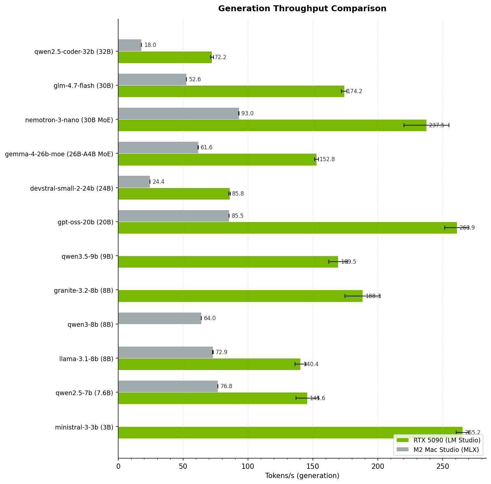
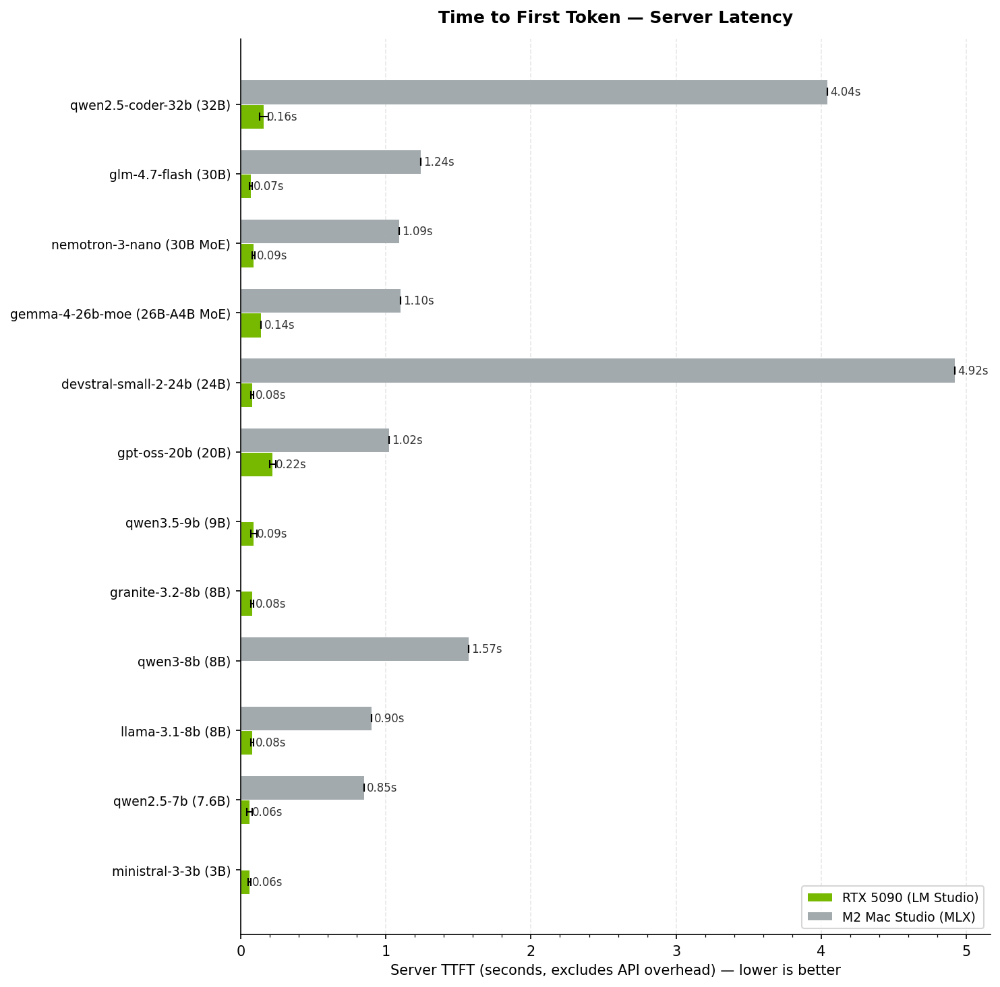

# LLM Inference Benchmarks — Consumer Hardware

Systematic, reproducible benchmarks for local LLM inference on consumer-grade hardware. Measuring what matters for real-world local AI deployment: tokens per second, time to first token, VRAM usage, and power consumption.

> **Goal**: Provide clear, comparable data so engineers can make informed decisions about hardware and model selection for local inference workloads.

<!-- BENCHMARK_RESULTS_START -->
## Results

> Last updated: 2026-04-03 | 512 prompt tokens, 128 generation tokens, 3 runs

### Generation Throughput


### Time to First Token


### RTX 5090 (LM Studio)

| Model | Params | Generation (t/s) | Prompt Eval (t/s) | TTFT Server (s) | TTFT Total (s) | Peak VRAM | Avg Power |
|-------|--------|------------------:|------------------:|----------------:|---------------:|-----------:|----------:|
| ministral-3-3b | 3B | **265.2** | 243.9 | 0.060 | 2.10 | 7.4 GB | 119 W |
| qwen2.5-7b | 7.6B | **145.6** | 242.7 | 0.060 | 2.11 | 11.4 GB | 146 W |
| llama-3.1-8b | 8B | **140.4** | 238.1 | 0.080 | 2.15 | 12.1 GB | 146 W |
| granite-3.2-8b | 8B | **188.3** | 240.3 | 0.080 | 2.13 | 9.3 GB | 160 W |
| qwen3.5-9b | 9B | **169.5** | 239.2 | 0.090 | 2.14 | 10.6 GB | 159 W |
| gpt-oss-20b | 20B | **260.9** | 225.4 | 0.220 | 2.27 | 15.2 GB | 104 W |
| devstral-small-2-24b | 24B | **85.8** | 239.8 | 0.080 | 2.14 | 18.6 GB | 226 W |
| gemma-4-26b-moe | 26B-A4B MoE | **152.8** | 234.1 | 0.140 | 2.19 | 22.2 GB | 119 W |
| glm-4.7-flash | 30B | **174.2** | 240.9 | 0.070 | 2.12 | 21.1 GB | 111 W |
| nemotron-3-nano | 30B MoE | **237.5** | 239.2 | 0.090 | 2.14 | 26.9 GB | 105 W |
| qwen2.5-coder-32b | 32B | **72.2** | 232.4 | 0.160 | 2.20 | 23.2 GB | 156 W |

*NVIDIA GeForce RTX 5090 — 32607 MB VRAM — Engine: LM Studio*

### M2 Mac Studio (MLX)

| Model | Params | Generation (t/s) | Prompt Eval (t/s) | TTFT (s) | Peak Memory |
|-------|--------|------------------:|------------------:|---------:|-----------:|
| qwen2.5-7b | 7.6B | **76.8** | 602.8 | 0.85 | 4.8 GB |
| llama-3.1-8b | 8B | **72.9** | 566.4 | 0.90 | 5.1 GB |
| qwen3-8b | 8B | **64.0** | 326.5 | 1.57 | 5.2 GB |
| gpt-oss-20b | 20B | **85.5** | 501.5 | 1.02 | 11.7 GB |
| devstral-small-2-24b | 24B | **24.4** | 104.2 | 4.92 | 13.8 GB |
| gemma-4-26b-moe | 26B-A4B MoE | **61.6** | 465.2 | 1.10 | 15.3 GB |
| nemotron-3-nano | 30B MoE | **93.0** | 468.6 | 1.09 | 19.0 GB |
| glm-4.7-flash | 30B | **52.6** | 413.7 | 1.24 | 17.5 GB |
| qwen2.5-coder-32b | 32B | **18.0** | 126.8 | 4.04 | 19.1 GB |

*Apple M2 Max — 64.0 GB unified memory — Engine: MLX*
<!-- BENCHMARK_RESULTS_END -->

## Metrics Captured

Every benchmark run captures the following metrics, averaged over 3 runs with standard deviation reported:

| Metric | Description |
|--------|-------------|
| **Tokens/s (generation)** | Decode speed — how fast the model generates output tokens. The primary metric for interactive use. |
| **Tokens/s (prompt eval)** | Prefill speed — how fast the model processes the input prompt. Matters for long-context workloads. |
| **Time to first token (TTFT)** | Latency from submitting a prompt to receiving the first output token. Critical for perceived responsiveness. |
| **Peak VRAM usage** | Maximum GPU memory consumed during inference. Determines which models fit on your hardware. |
| **Power consumption** | GPU power draw sampled at 100 ms intervals via `nvidia-smi`. Useful for efficiency comparisons and thermal planning. |

## Quick Start

### Prerequisites

- Python 3.10+
- [llama.cpp](https://github.com/ggerganov/llama.cpp) built with CUDA support
- `nvidia-smi` available on PATH (NVIDIA GPU systems)
- GGUF model files downloaded locally

### Install Dependencies

```bash
pip install -r requirements.txt
```

### Configure

Edit `config.yaml` to match your setup:

```yaml
hardware_profile: "rtx5090"
llama_bench_path: "/path/to/llama-bench"
model_dir: "/path/to/your/models"
```

### Run Benchmarks

```bash
# Run all configured benchmarks
python run_benchmarks.py

# Run a specific model
python run_benchmarks.py --model llama-3.1-8b

# Run a specific model at a specific quantisation
python run_benchmarks.py --model llama-3.1-8b --quant Q4_K_M

# Dry run — show what would be executed without running
python run_benchmarks.py --dry-run
```

Results are saved to `results/{hardware_profile}/` as JSON files and a summary markdown table is generated after all runs complete.

## Project Structure

```
.
├── README.md
├── LICENSE
├── config.yaml                  # Benchmark configuration
├── run_benchmarks.py            # Main benchmark runner
├── requirements.txt             # Python dependencies
├── hardware/
│   └── rtx5090.md               # Hardware profile
├── docs/
│   └── methodology.md           # Measurement methodology
└── results/
    └── rtx5090/                 # Results by hardware profile
        ├── llama-3.1-8b_Q4_K_M_20260331_120000.json
        └── summary.md
```

## How to Contribute

Contributions of benchmark results from other hardware are welcome. To submit results:

1. **Fork this repository.**
2. **Create a hardware profile** in `hardware/` using the existing template (see `hardware/rtx5090.md`).
3. **Set your `hardware_profile`** in `config.yaml` to match your new profile name.
4. **Run the benchmarks** using the standard configuration (same prompt length, generation length, and run count).
5. **Submit a pull request** with your hardware profile and results directory.

Please ensure:
- You use the unmodified benchmark parameters from `config.yaml` (512 prompt tokens, 128 generation tokens, 3 runs).
- Your system is not under other significant load during benchmarking.
- You include complete system information in your hardware profile.

## Methodology

See [docs/methodology.md](docs/methodology.md) for full details on how measurements are taken, statistical approach, controlled variables, and known limitations.

## Author

**Patrick Whelan** — AI & Technical Architect

[patrickwhelan.uk](https://patrickwhelan.uk)

## License

[MIT](LICENSE)
